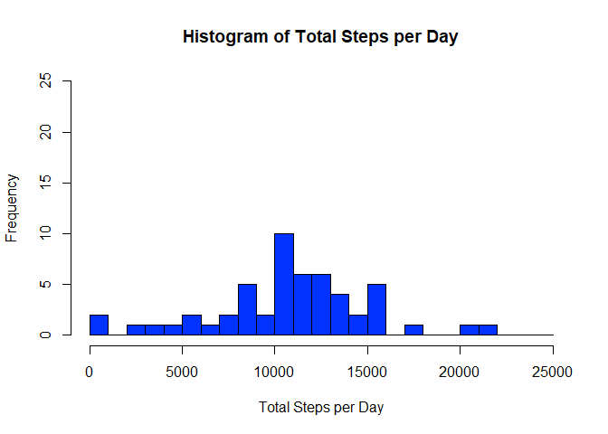
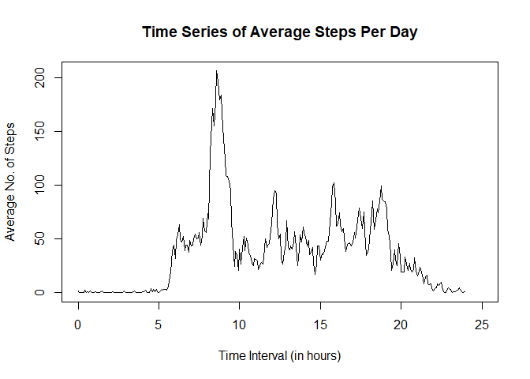
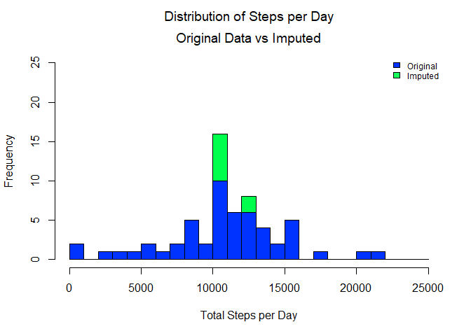
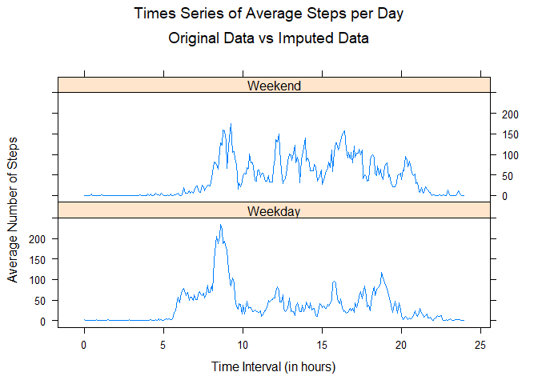

# Reproducible Research: Peer Assessment 1

## Introduction
### (This is an excerpt from the course assignment)

It is now possible to collect a large amount of data about personal movement using activity monitoring devices such as a Fitbit, Nike Fuelband, or Jawbone Up. These type of devices are part of the "quantified self" movement - a group of enthusiasts who take measurements about themselves regularly to improve their health, to find patterns in their behavior, or because they are tech geeks. But these data remain under-utilized both because the raw data are hard to obtain and there is a lack of statistical methods and software for processing and interpreting the data.


## Loading and preprocessing the data

The data consists of around 17,500 records of activity data from a personal monitoring device. The device collects data at 5 minute intervals throughout the day. The data consists of two months of data from an anonymous individual collected during the months of October and November, 2012, and include the number of steps taken in 5-minute intervals each day.

This program is loaded in R first. A check is made to see if the data exists in our working directory. If it does not, it checks if the zipfile is available. If it is, it will extract the zipfile to the working directory, otherwise, it will download the zipfile and then extract its contents to the working directory.


```r
# Load the necessary libraries
library(data.table)

# Load the data for use 
# Check if the data files are available in the dir.
# If the files are available, read them using readRDS()
# If the files are not available, check if the zip file is available.
# If the zipfile is available, unzip the data to the working directory.
# If the zipfile does not exist, download it first, and then unzip.

# Store the filenames in string variables for ease of coding
datasource <- "./activity.csv"
datazip <- "./repdata%2Fdata%2Factivity.zip"
dataURL <- "https://d396qusza40orc.cloudfront.net/repdata%2Fdata%2Factivity.zip"

# Check if both files exist.
if( !file.exists(datasource) ){
        if(!file.exists(datazip)){
                download.file(dataURL, destfile = datazip)
        }
        unzip(datazip, exdir = ".")
}

# Load the data and manual from their respective sources
project.data <- read.csv(datasource)
```

The data originally has three columns:

* steps: The number of steps recorded during that date and time interval
* date: The date when the number of steps was recorded
* interval: The five-minute interval when the number of steps was recorded. It is of the format [hh][mm], where [hh] denotes the hour of the day it was recorded, and [mm] denotes the minute of the day it was recorded

The format of the data for interval ([hh][mm]) is not very intuitive. For the first hour, the last interval is 55, and then the next interval is 100. For the second hour, the last interval is 155, and then the next interval is 200. It makes more sense to convert this data into a more meaningful measure. For this exercise, we convert it to the number of hours elapsed in the day. To do this, we do the following steps

1.) Force the values of the interval column into a four-digit number and convert it to string. So interval 55 in this case becomes 0055, interval 100 becomes 0100, and so forth.

2.) we take the first two digits from the string in Step 1, and convert it to numeric. This represents the hour of that interval.

3.) We then take the last two digits from the string in Step 1. This represents the fraction of hours in the interval, measured in minutes. We divide this by 60 (60 minutes in 1 hour) to convert this to number of hours

4.) Add the results from Step 2 and Step 3, to get the column "interval.hours", which is the time interval the activity happened, measured in hours. So interval 55 becomes 0.91667 hours, 155 becomes 1.91667 hours, and so on.


```r
# The 5-minute interval data is of the format 'hhmm'
# This format is vague, so we should transform this into
# a format that is clearer, such as converting it to number of hours.

# Create a new column, interval.hours, which expresses the 5-minute intervals
# in number of hours.

project.data$interval.hours <- 
        as.numeric(sub("(.{2})(.*)", "\\1", 
                       sprintf("%04d", project.data$interval))) +
        as.numeric(sub("(.{2})(.*)", 
                       "\\2", sprintf("%04d", project.data$interval)))/60
```


## What is mean total number of steps taken per day?

To calculate the mean total number of steps taken per day, we first create a dataframe, 'total.steps', which summarizes the total number of steps by date and interval. 


```r
# Create a dataframe, 'total.steps', which records total steps per day
total.steps <- aggregate(steps ~ date, project.data, sum)
```

We then plot the dataframe on a histogram to give us an idea of the distribution of total steps per day.


```r
# plot 'total.steps' in a historgram
hist(total.steps$steps, xlab = "Total Steps per Day", 
     main = "Histogram of Total Steps per Day", breaks=seq(0,25000,by=1000),
     col = rgb(0,0.2,1,1), ylim = c(0,25))
```

<!-- -->

We can see from the histogram that the mean is at least 10,000. We use more scripts to claculate the mean and median of this distribution.


```r
mean.steps <- mean(as.numeric(total.steps$steps), na.rm = TRUE)
median.steps <- median(as.numeric(total.steps$steps), na.rm = TRUE)
cat("\nThe average number of steps per day is ", mean.steps,".\n",
    "The median number of steps per day is ",median.steps,".", sep = "")
```

```
## 
## The average number of steps per day is 10766.19.
## The median number of steps per day is 10765.
```

*So the mean is **10,766 steps** and the median is **10,765 steps***

## What is the average daily activity pattern?

To determine the average daily activity pattern, we first create a dataframe, 'avg.steps.pattern', which summarizes the average number of steps across all days by interval in hours.


```r
# Create a dataframe, avg.steps.pattern, which calculates the average
# number of steps for each 5-minute interval during the day.

avg.steps.pattern <- aggregate(steps ~ interval.hours, project.data, mean)
```

We then make a time series plot using 'avg.steps.pattern'.

```r
plot(avg.steps.pattern, type = 'l', xlim = c(0,25), 
     xlab = "Time Interval (in hours)", ylab = "Average No. of Steps",
     main = "Time Series of Average Steps Per Day")
```

<!-- -->

We see that the maximum average number of steps happens in an interval somewhere between the 7th hour and 10th hour. We use a script to determine when this maximum is reached.


```r
max.interval <- avg.steps.pattern[avg.steps.pattern$steps == max(avg.steps.pattern$steps),1]
cat("The average number of steps is highest at",floor(max.interval),
                "hours and", 
                (max.interval - floor(max.interval)) * 60, 
                "minutes.", sep = " ")
```

```
## The average number of steps is highest at 8 hours and 35 minutes.
```

*The maximum happens at the interval **8 hours and 35 minutes**.*

## Imputing missing values

Let's check if this data contains missing values for the number of steps using a script.

```r
summary(project.data$steps)
```

```
##    Min. 1st Qu.  Median    Mean 3rd Qu.    Max.    NA's 
##    0.00    0.00    0.00   37.38   12.00  806.00    2304
```

*There are **2,304 missing values** in this dataset.*

Let's check the percentage of number of missing values relative to the dataset.

```r
nrow(project.data[is.na(project.data$steps),]) / nrow(project.data)
```

```
## [1] 0.1311475
```

13% of the data consists of missing values, which is significant. We need to devise a strategy to replace these missing values without compromising the distribution of the data.

We saw previously that there is a time series for the average number of steps across all day by time interval, and this can be used as a starting point. However, we should also keep in mind that activity patterns might change between weekdays and weekends. This makes sense, given that weekdays can be more scheduled and structured due to work or school, while weekends activities are less structured.

So, to impute the data without significantly changing the distribution, we replace missing values with their corresponding average number of steps by time interval and by weekday/weekend.

First, we add a new column to our dataset, 'day.in.week', which classifies the record as 'weekday' or 'weekend' depending on the value in the date column.

```r
# Create the column, day.in.week, for the project data.
# If the date falls on a Saturday or Sunday, classify it as a 'weekend'
# Otherwise, classify it as a 'weekday'
project.data$day.in.week <- 
        ifelse(weekdays(as.Date(project.data$date)) %in% c("Saturday","Sunday"),
               "Weekend", "Weekday")
```


We then get a subset of the data with missing values, called 'data.missing', and a subset of data of observed values, called 'data.observed'

```r
# create separate subsets of data where the number of steps is missing
# and where the number of steps was observed.
data.missing <- project.data[is.na(project.data$steps),]
data.observed <- project.data[!is.na(project.data$steps),]
```

Next, we create a reference table called 'data.reference' which contains the values we will use to impute. These values will be the average number of steps across all days by time interval and day in week (weekday/weekend)

```r
# create a reference table of the values we will impute
# to the missing values in data.missing.
# this table will contain the average number of steps
# by time interval and day in week (weekday/weekend)
data.reference <- 
        aggregate(steps ~ interval + day.in.week, project.data, mean)
```

We then merge the 'data.reference' and 'data.missing' dataframes so that the missing values are replaced with the values found in 'data.reference'. 

```r
# Merge the missing data with the data reference, filling in the missing data.
# Call this dataframe data.impute.
# Afterwards, arrange this dataframe to mimic the format of project.data
data.impute <- merge(data.missing, data.reference, by=c("interval", "day.in.week"))
data.impute <- data.impute[,c("steps.y","date","interval",
                          "interval.hours","day.in.week")]
colnames(data.impute)[1] <- c("steps")
```

Then finally, we combine the observed values in 'data.observed' with the imputed values in 'data.impute' to come up with a new dataframe, 'data.imputed'.


```r
# Combined the observed data with the imputed data.
data.imputed <- rbind.data.frame(data.observed, data.impute)
```

Let's compare the histograms of the new dataset with the original dataset to see if the shape was significantly changed due to the imputed values.


```r
# Compare the distribution of the original dataset with the imputed dataset.
total.steps.original <- aggregate(steps ~ date, project.data, sum)
total.steps.imputed <- aggregate(steps ~ date, data.imputed, sum)

# Plot the histogram of total number of steps from the original dataset
# Then plot the histogram of total number of steps from the imputed dataset
par(mfrow = c(1,1))
hist(total.steps.imputed$steps, breaks=seq(0,25000,by=1000), xlab = "Total Steps per Day", 
     col = rgb(0,1,0.3,1), ylim = c(0,25),
     main = expression(atop("Distribution of Steps per Day",
                            paste("Original Data vs Imputed"))))

hist(total.steps.original$steps, breaks=seq(0,25000,by=1000), xlab = "Total Steps per Day", 
     col = rgb(0,0.2,1,1), ylim = c(0,25),
     add=T)
legend("topright", c("Original","Imputed"), 
       fill=c(rgb(0,0.2,1),rgb(0,1,0.3,0.9)), cex = 0.75, bty = 'n')
```

<!-- -->

The imputed data slightly added more observations to the distribution of the original data. However, the overall shape of the data did not change much relative to the original shape. We can also compare mean and median to see if there was a change in these values.


```r
mean.steps.imputed <- mean(as.numeric(total.steps.imputed$steps), na.rm = TRUE)
median.steps.imputed <- median(as.numeric(total.steps.imputed$steps), na.rm = TRUE)
cat("\nThe average number of steps per day of the original dataset is ", 
    mean.steps,
    ".\nThe average number of steps per day of the new dataset is ",
    mean.steps.imputed,
    "\nThis is a ",
    abs(round(((mean.steps.imputed - mean.steps)/mean.steps)*100,2)),
    ifelse(mean.steps.imputed - mean.steps<0,
           "% decrease in the mean.",
           "% increase in the mean."),
    "\n\n",
    "The median number of steps per day of the original dataset is ",
    median.steps,
    ".\nThe median number of steps per day of the new dataset is ",
    median.steps.imputed,
    ".",
    "\nThis is a ",
    abs(round(((median.steps.imputed - median.steps)/median.steps)*100,2)),
    ifelse(median.steps.imputed - median.steps<0,
           "% decrease in the median.",
           "% increase in the median."),
    sep = "")
```

```
## 
## The average number of steps per day of the original dataset is 10766.19.
## The average number of steps per day of the new dataset is 10762.05
## This is a 0.04% decrease in the mean.
## 
## The median number of steps per day of the original dataset is 10765.
## The median number of steps per day of the new dataset is 10571.
## This is a 1.8% decrease in the median.
```

If the imputed values are included, the mean decreases only by 0.04%, while the median decreases by 1.8%.

The imputed values lets us use the information from the missing data, which accounted for 13% of the data. Using the imputed values did not significantly alter the shape of the dataset's distribution, and it only resulted in a minimal decrease in mean and median, hence, we should feel comfortable using this imputed table for more analysis.


## Are there differences in activity patterns between weekdays and weekends?

Because we have a column in our new dataset to determine whether the date falls on a weekday or weekend, we just need to aggregate 'data.imputed' by 'interval.hour' and by 'day.in.week', and applying the mean function to the number of steps. We can then plot using Lattice's xyplot to compare the two time series - one for weekday activity and the other for weekend activity.


```r
require(lattice)
```

```
## Loading required package: lattice
```

```r
avg.steps.pattern.by.day <- aggregate(steps ~ interval.hours + day.in.week, 
                                      data.imputed, mean)
xyplot(steps ~ interval.hours|day.in.week, avg.steps.pattern.by.day, 
       type = 'l', layout = c(1,2), xlab = 'Time Interval (in hours)',
       ylab = 'Average Number of Steps',
       main = expression(atop("Times Series of Average Steps per Day",
                              paste("Original Data vs Imputed Data"))))
```

<!-- -->

You can see from the weekend activity time series that

* activity starts at around the 8th hour
* activity fluctates between 0 steps and 150 steps until the 21st hour.
* activity stops after the 20th hour.

Meanwhile, you can see from the weekday activity time series that

* activity starts at around the 6th hour.
* activity fluctuates between 50 steps and 100 steps from the 6th hour up to the 8th hour.
* activity then peaks above 200 starting at the 8th hour, then dips between the 0 steps to 50 steps at the 10th hour.
* activity then fluctuates between 50 steps and 100 steps from the 10th hour up to the 20th hour.
* activity stops after the 20th hour.

Based on these observations, it can be concluded that the activity patterns differ between weekdays and weekends. Again, this makes sense, since weekday activities are more structured and follow a schedule, such as school or work, while weekdays are not as constrained and can include a multitiude of activities.
